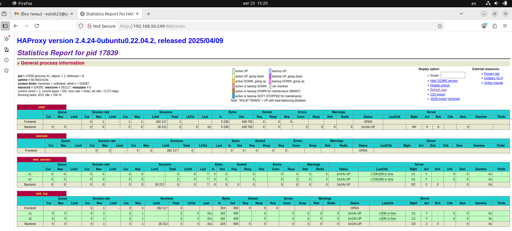

# Домашнее задание к занятию "Кластеризация и балансировка нагрузки" - Котов Г.И.

### Задание 1
1. Запустите два simple python сервера на своей виртуальной машине на разных портах
2. Установите и настройте HAProxy, воспользуйтесь материалами к лекции по ссылке
3. Настройте балансировку Round-robin на 4 уровне.
4. На проверку направьте конфигурационный файл haproxy, скриншоты, где видно перенаправление запросов на разные серверы при обращении к HAProxy.

### Решение 1: 

### Задание 2

1. Запустите три simple python сервера на своей виртуальной машине на разных портах
2. Настройте балансировку Weighted Round Robin на 7 уровне, чтобы первый сервер имел вес 2, второй - 3, а третий - 4
3. HAproxy должен балансировать только тот http-трафик, который адресован домену example.local
4. На проверку направьте конфигурационный файл haproxy, скриншоты, где видно перенаправление запросов на разные серверы при обращении к HAProxy c использованием домена example.local и без него.

#### Решение 2:

